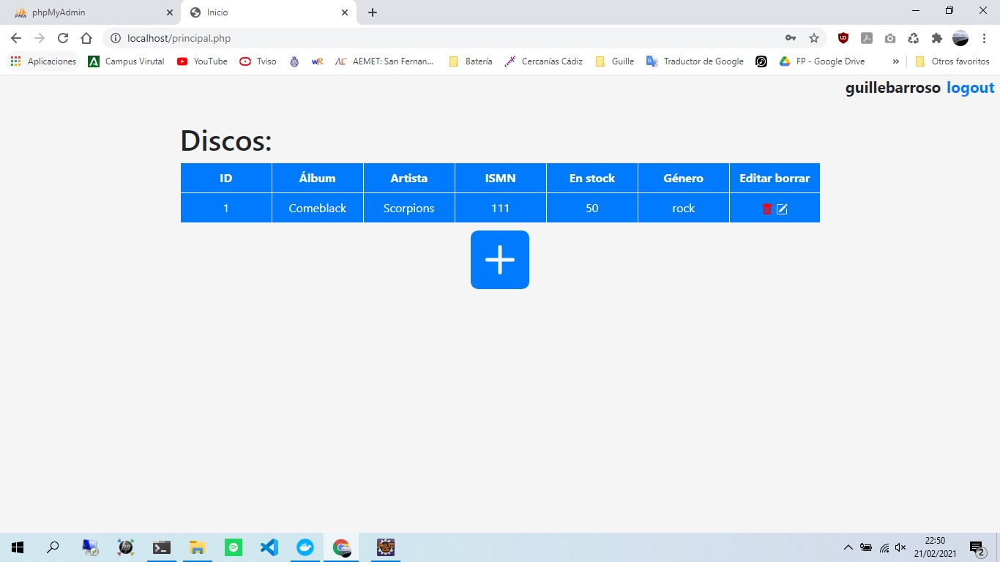
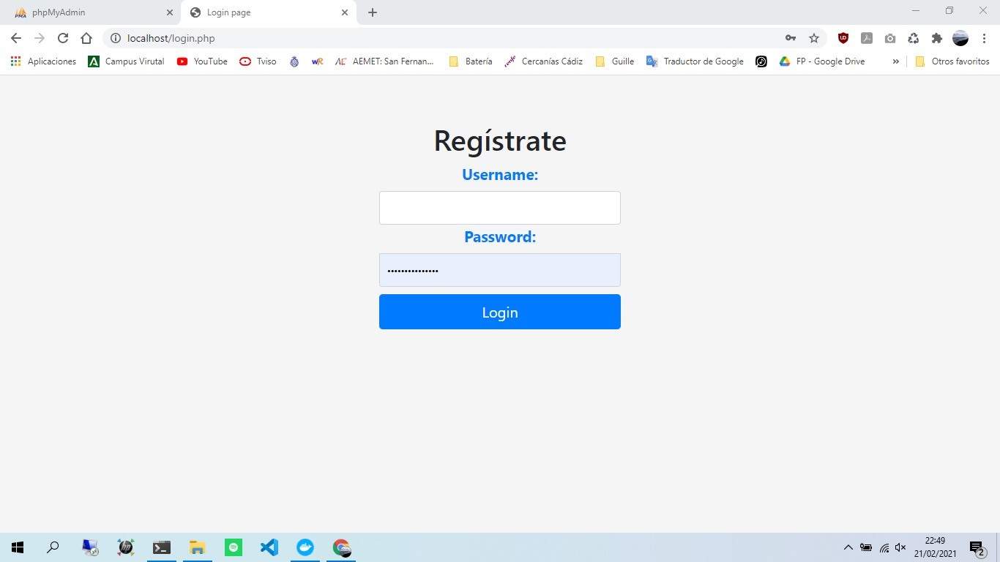
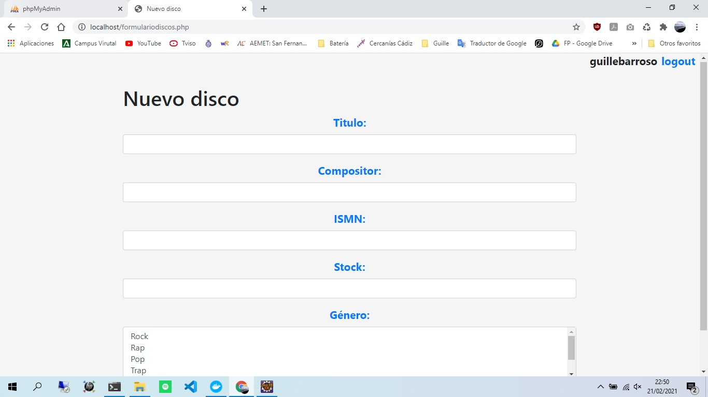

# CRUD en PHP
Esta aplicación para gestiorar el **CRUD** (Creación, consulta, modificación y borrado) de una tabla
incluyendo login/logout de usuarios para poder acceder.\
La aplicación consistirá en una página de login que debe comprobar nombre de usuario y contraseña
(almacenados en una tabla creada al inicializar la base de datos), una principal donde aparecerá el listado de las filas almacenadas en la tabla y otra con el formulario para dar de alta filas o editarlas.

## Características

La página principal debe proporcionar enlaces para el alta, edición o borrado de las filas de la tabla:
- El enlace al alta será uno (o dos, según el diseño) en toda la página.
- Habrá un enlace de edición y otro de borrado por cada fila de la tabla listada.
- Cuando se pulse el enlace de borrado es necesario mostrar un mensaje modal de confirmación (para evitar
errores).
Se tendrán en cuenta los siguientes elementos:
- Presentación: Es necesario dar un estilo adecuado a las páginas, lo que puede incluir el uso de
herramientas de frontend del estilo bootstrap o semantic ui.
- Uso de fuentes de iconos: Para conseguir resultados atractivos es interesante usar fuentes de iconos para
los enlaces de nuestra aplicación. Recomendaciones: fontawesome y captain icon.
- Uso de sesiones y cookies para autenticación: El sistema de login/logout debe estar controlado por
sesiones y cookies o sólo con sesiones.
- Protección contra inyección SQL: Todas las sentencias SQL que se ejecuten deben usar el mecanismo del
objeto PDO para evitar las inyecciones SQL.

## Capturas del proyecto

## Para ponerlo en marcha...
Tan solo tendremos que hacer un `docker-compose up` en la terminal y ya estará funcionando!
